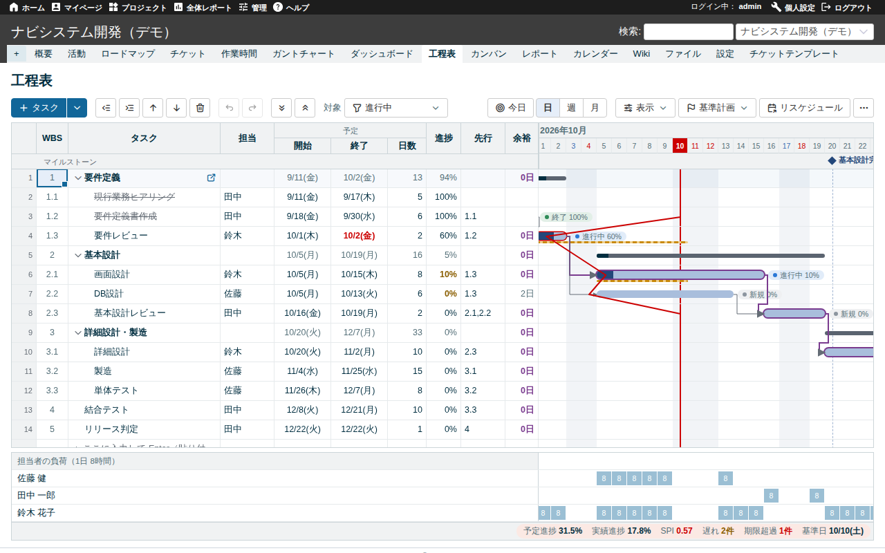
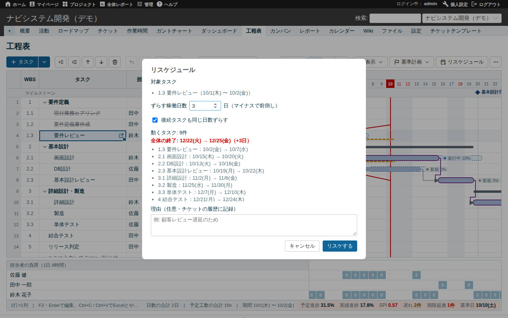
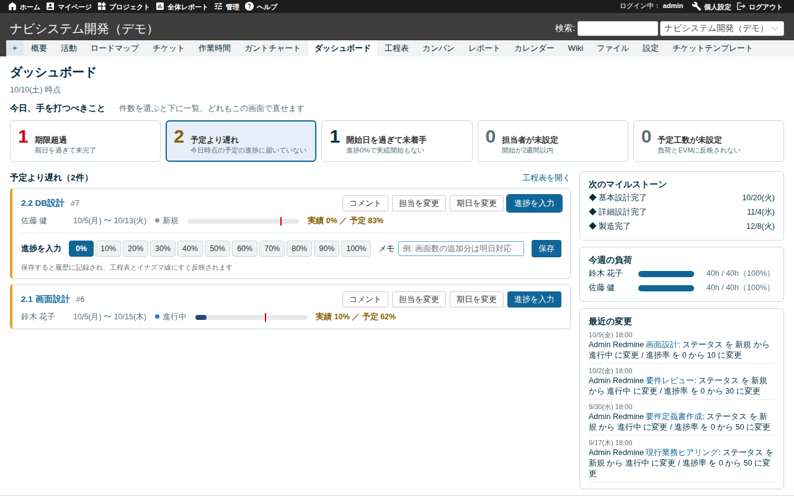
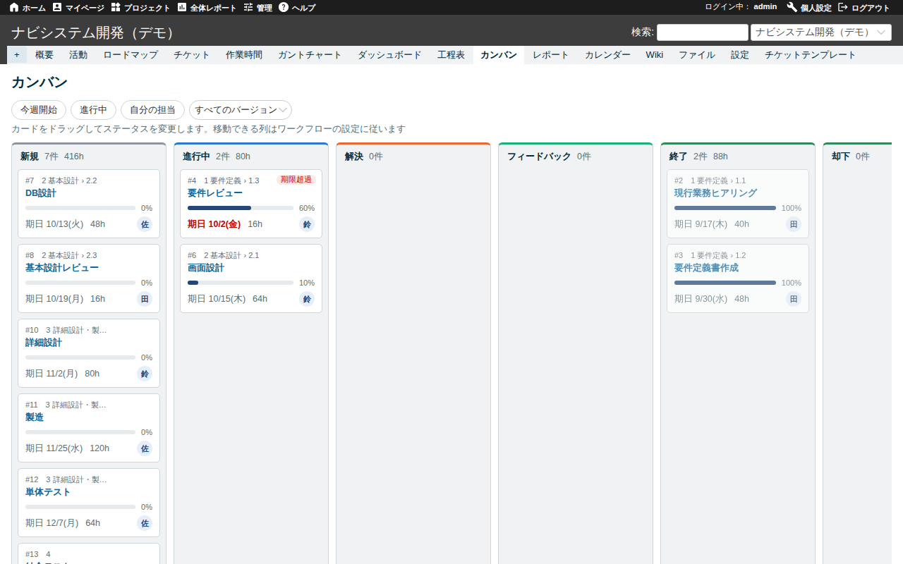
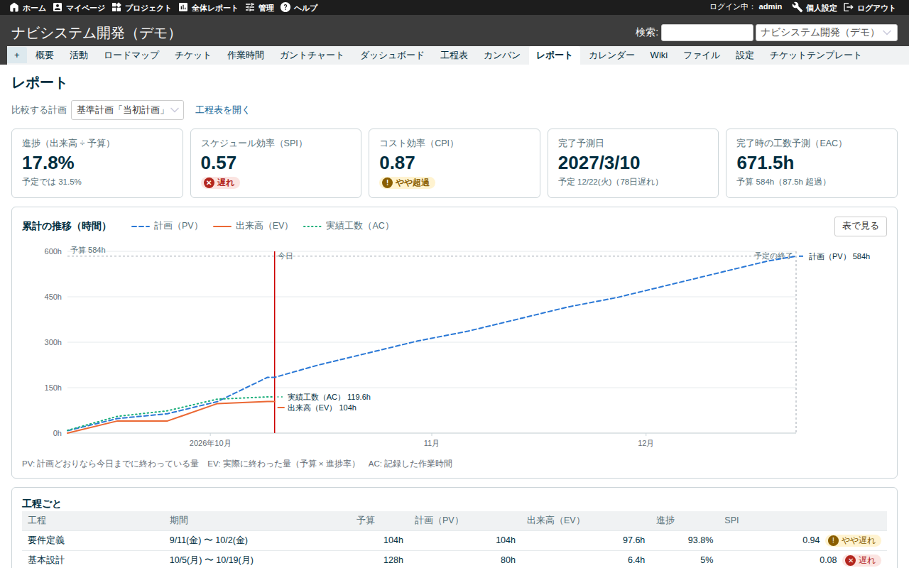
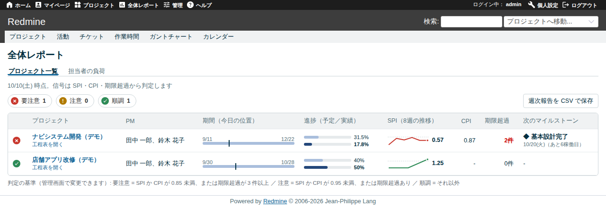

# Gantrix: Redmine向け Excel互換WBS＆ガントチャートプラグイン

[English](README.md) | **日本語**

[](https://github.com/yukkes/redmine_gantrix/actions/workflows/ci.yml)
[](https://www.redmine.org/)
[](LICENSE)
[](https://github.com/rubocop/rubocop)

**Gantrix (Gantt + Matrix)** は、Redmine上でExcel同等のWBS操作性とプロジェクト工学（CPM / EVM）に基づく日程管理を実現するフルスタックプラグインです。

「Excel管理によるバージョン分散・履歴喪失」と「Redmine標準ガントチャートの編集レスポンス・操作性の課題」を同時に解決します。外部UIフレームワークに依存しない独自実装の仮想スクロール機構を備え、1,000件規模のWBSタスクを約0.3秒でレンダリングします。

---

## アーキテクチャと設計思想

### 1. ゼロ・マイグレーション設計（スキーマ変更なし）
本プラグインは**独自のデータベーステーブルを一切追加しません**。
- **データ永続化**: すべてRedmine標準の `issues`, `custom_values`, `journals`, `settings` にマッピングされます。
- **既存システムへの安全性**: 既存のチケット一覧、公式ガントチャート、外部連携（REST API）の動作を一切破壊しません。
- **完全なロールバック性**: プラグインディレクトリを削除してRedmineを再起動するだけで、DBスキーマを汚すことなく完全に導入前の状態へ切り戻しが可能です。

### 2. データマッピング仕様
| データ項目 | 内部保存先 | 実装仕様 |
| :--- | :--- | :--- |
| **実績開始日 / 完了日** | チケット カスタムフィールド | プラグイン初期化時に自動生成（日付型） |
| **WBS並び順** | チケット カスタムフィールド | トラッカー非紐付け（標準のチケット入力画面には露出せず内部管理） |
| **ベースライン** | プラグイン設定 + ジャーナル | スナップショット時点のタイムスタンプのみを保持し、チケットの変更履歴（`journals`）から過去の属性値を動的に再構成 |
| **カレンダー・設定** | `settings` / ユーザー設定 | 祝日キャッシュおよびユーザーごとの表示設定 |

### 3. セキュリティ・閉域網対応
外部CDNへの依存はゼロです。アイコン（Tabler Icons, 4KB）を含む静的アセットはすべてプラグイン内に同梱されているため、外部通信が遮断された閉域環境（オンプレミス / インフラ制限ネットワーク）でも完全に動作します。

---

## スクリーンショット

### WBS & ガントチャート（メイン画面）
クリティカルパス、トータルフロート、リソース負荷状況をリアルタイム計算・重畳表示。



| リスケジュール・プレビュー | 運用ダッシュボード |
| :---: | :---: |
|  |  |
| 稼働日計算による影響分析とジャーナル自動記録 | アラートタスクのインライン修正 |

| ワークフロー制御カンバン | 定量進捗管理（EVMレポート） |
| :---: | :---: |
|  |  |
| Redmineワークフロー定義に厳密準拠 | PV / EV / AC推移とSPI・CPI・EAC自動算出 |

### ポートフォリオ（複数プロジェクト横断管理）


---

## 技術仕様・主要機能

### 1. スケジュール & WBSエンジン
- **キーボードドリブンUI**: セル直接編集、`Enter`（下移動）、`Shift+Enter`（上移動）。日本語IME確定時のEnter誤送信を防止するイベントハンドリングを実装。
- **スプレッドシート互換**: 範囲選択、タブ区切りテキストのクリップボード連携、Excelからの直接ペースト、オートフィル、`Ctrl+D`、アンドゥ／リドゥ（`Ctrl+Z` / `Ctrl+Y`）。
- **WBS一括インポート**: Excelで作成したWBSをコピーし最終行へペーストすることで、行頭インデント（半角スペース数）を解析してチケット親子階層を一括構築。
- **ガント操作**: バーのドラッグ＆ドロップ（期間変更・移動）、エンドポイントのドラッグによる先行・後続リレーション（`precedes` / `follows`）の定義・削除。
- **実績連動**: 進捗率（%）更新時の実績日自動補完、イナズマ線描画、マイルストーン（期日付きバージョン）表示。

### 2. スマート・リスケジューリングエンジン
- **非稼働日・祝日スキップ**: 後続タスクの連動シフト時、稼働日カレンダーを評価して非稼働日を自動スキップ。
- **変更インパクトの事前評価**: 指定日数シフト時の「プロジェクト最終期日への影響」「連動する全後続タスク」の差分プレビューをモーダルで表示。
- **トレーサビリティ**: シフト実行時、変更理由を対象チケットのRedmineジャーナル（履歴）へ自動で監査ログとして書き込み。

### 3. EVM（アーンド・バリュー・マネジメント）＆ 定量分析
- **プロジェクト工学指標の自動算出**:
  - クリティカルパス（Critical Path）およびトータルフロート（Total Float / 稼働日単位）
  - EVM指標: 計画価値（PV）、獲得価値（EV）、実コスト（AC）、スケジュール効率指数（SPI）、コスト効率指数（CPI）、完成時総コスト予測（EAC）、完了予測日
- **ベースライン比較**: 計画時のベースラインと現在の予定バーを2段表示し、遅延日数を可視化。

### 4. ガバナンス・マルチプロジェクト管理
- **権限・ロール（RBAC）**: Redmine標準のロールと権限設定（スケジュール閲覧/編集、ダッシュボード、カンバン、レポート）に完全準拠。
- **カンバン**: ドラッグ＆ドロップによるステータス変更時、Redmineで定義されたロール別ワークフロー遷移規則を厳格にバリデーション。
- **ポートフォリオ & 全社負荷**: プロジェクト横断でのSPI/CPI健全性監視、週次サマリCSV出力、担当者×週のリソースヒートマップ表示。
- **イベント駆動通知**: 先行タスクがすべて完了ステータスとなった際、後続タスクの担当者へメール通知をトリガー。

---

## 稼働日・祝日判定仕様

**管理 → Gantrix の設定** にてカレンダー判定ロジックを指定可能。

1. **内閣府祝日CSV（デフォルト）**:
   - 内閣府公式の「国民の祝日」CSVを取得・内部キャッシュ。
   - バックグラウンドで30日ごとに自動更新。CSVにない年（1949〜2150年）は、その年の祝日法の規定（移動した祝日・振替休日・国民の休日・皇室の儀式）に沿って計算。1955年以降は内閣府のCSVと全日一致することを確認済み。
   - それ以外の年（「期限なし」の 9999-12-31 など）の日付も扱え、祝日はなしとして計算。
2. **カスタムCSVインポート**:
   - 海外祝日・客先カレンダーに対応。`YYYY-MM-DD,祝日名称`（UTF-8 / Shift_JIS）をロード可能。
3. **カレンダー無効（標準曜日のみ）**:
   - Redmine標準の「非稼働日」設定および手動登録の会社休日（年末年始等）のみを適用。

### 他から大きく離れた日付

9999-12-31 の期日や 3 年のような入力誤りがあっても、画面が数千年分に広がることはありません。工程表は今日を中心に最大5年を描き（他の日付から2年以上離れた日付は期間の計算から外す）、はみ出すバーは端で切って表示します。レポートはそのようなタスクを出来高の集計から外し、件数を表示します。稼働日数は1日ずつ数えずに計算で求めるため、長い期間でも処理時間は変わりません。

---

## セットアップ手順

### 前提条件
- Redmine: `5.0.x`, `5.1.x`, `6.0.x`, `6.1.x`, `7.0.x`
- Ruby: 各Redmineバージョンに準拠
- DB: MySQL / PostgreSQL / SQLite3（Redmineがサポートする全RDBMS）

### 1. 配置
```bash
cd /path/to/redmine/plugins
git clone https://github.com/yukkes/redmine_gantrix.git   # ディレクトリ名は redmine_gantrix のままにする
# 更新するとき: cd redmine_gantrix && git pull
```

### 2. 再起動（マイグレーション不要）
```bash
# DBマイグレーションコマンド（bundle exec rake redmine:plugins:migrate）は実行不要です。
touch /path/to/redmine/tmp/restart.txt
# または Webサーバー（Puma / Unicorn / Passenger / Systemd）を再起動
```

### 3. 初期設定
1. **管理 → Gantrix の設定**: 祝日ソースおよび会社独自休日の設定。
2. **管理 → ロールと権限**: 対象ロールに対し「工程表（Gantrix）」「ダッシュボード（Gantrix）」「カンバン（Gantrix）」「レポート（Gantrix）」欄の各権限（閲覧・編集）を有効化。
3. **プロジェクト設定 → モジュール**: 対象プロジェクトで `工程表（Gantrix）` を有効化。
4. **管理 → 設定 → 表示 → テーマ**（任意）: 同梱のテーマ `Gantrix` を選択。Redmine 標準テーマのレイアウトのまま、色とアイコンを lychee_theme_basic に合わせたもの（Redmine 5.1 / 6 / 7 対応、JavaScript なし）。

---

## 推奨プラグイン

以下のプラグインは Redmine 5.0〜7.0 で Gantrix と組み合わせて検証しており（`docker/dev/test_all.sh`）、運用イメージ（`docker/deploy/`）にも同梱しています。

| プラグイン | 提供元 / ライセンス | 用途 |
| :--- | :--- | :--- |
| **[redmine_microsoftteams](https://github.com/yukkes/redmine_microsoftteams)** | yukkes / MIT | チケットやWikiの更新を Microsoft Teams へ通知。 |
| **[redmine_merge_request_links](https://github.com/yukkes/redmine_merge_request_links)** | yukkes / MIT | チケットに関連する GitHub・GitLab・Gitea・CodeCommit のプルリクエストをチケット画面に表示。 |
| **[redmine_textile_transparent](https://github.com/yukkes/redmine_textile_transparent)** | yukkes / MIT | テキスト書式「Hybrid」を追加。既存の Textile はそのまま表示し、新しい文章は Markdown で記述。データ変換は不要。 |
| **[redmine_issue_templates](https://github.com/agileware-jp/redmine_issue_templates)** | Agileware / GPL-2.0 | プロジェクト・トラッカーごとのチケットテンプレートと注記テンプレート。 |
| **[redmine_issue_trash](https://github.com/agileware-jp/redmine_issue_trash)** | Agileware / MIT | 削除したチケットをゴミ箱へ移して復元可能に。ベースラインやEVMの整合性を保護し、復元時にチケット間の先行・後続関係を自動修復します。 |

---

## 検証環境（Docker）

Redmine 5.0 / 5.1 / 6.0 / 6.1 / 7.0 のマルチバージョン検証環境および各種テストランナーを同梱しています。

```bash
# 全環境（ポート 3050 / 3005 / 3060 / 3006 / 3007）のビルド・起動・デモデータ投入
docker/dev/up.sh
```

| 対象バージョン | URL | 初期アカウント |
| :--- | :--- | :--- |
| **Redmine 5.0** | `http://127.0.0.1:3050/projects/demo/gantrix` | 管理者: `admin` / `admin`<br>検証ユーザー: `tanaka`, `suzuki`, `sato` (PW: `password123`) |
| **Redmine 5.1** | `http://127.0.0.1:3005/projects/demo/gantrix` | 同上 |
| **Redmine 6.0** | `http://127.0.0.1:3060/projects/demo/gantrix` | 同上 |
| **Redmine 6.1** | `http://127.0.0.1:3006/projects/demo/gantrix` | 同上 |
| **Redmine 7.0** | `http://127.0.0.1:3007/projects/demo/gantrix` | 同上 |

### テスト実行
```bash
docker/dev/test_all.sh            # 5バージョン一括クリーンインストール検証（CI同等）
docker/dev/test_all.sh 5.0 7.0    # 指定したRedmineバージョンのみ
PERF=1 docker/dev/test_all.sh     # 上記に加えて1,000タスクの描画負荷測定
npm i playwright && npx playwright install chromium   # 初回のみ（ブラウザテスト用）
node docker/dev/ui_test.js 3006   # PlaywrightによるE2Eブラウザテスト（デモデータ投入直後に実行）
node docker/dev/plugins_test.js 3006 # Playwrightによる推奨プラグインの動作確認
python3 docker/dev/smoke_test.py 3006 # API・HTTPエンドポイント疎通テスト
docker compose -f docker/dev/compose.yml exec redmine-6.1 bin/rails runner /seed/checks/perf_seed.rb   # 負荷測定用の1,000タスクを投入
node docker/dev/perf_test.js 3006 # 1,000タスク投入時のレンダリング・描画負荷測定（上の投入後に実行）
docker compose -f docker/dev/compose.large.yml up -d   # ECS のタスクと同じ制限（0.5 vCPU / 1 GB）の Redmine 7 + PostgreSQL
docker compose -f docker/dev/compose.large.yml exec -T redmine bin/rails runner /seed/checks/large_seed.rb   # 34,000件・履歴135,000件を投入
node docker/dev/large_test.js 3008 # その上で全画面が3秒以内に描画されることを確認
docker/dev/screenshots.sh         # READMEのスクリーンショットを撮り直す（英語・日本語のデモデータ）

# 検証環境の破棄
docker compose -f docker/dev/compose.yml down -v
```

### 運用イメージ（Redmine 7 + PostgreSQL 17）

`docker/deploy/` は本プラグイン（同梱テーマ `Gantrix` を含む）と関連プラグインを組み込んだ Redmine 7 イメージをビルドし、PostgreSQL 17 と組み合わせて起動します。

```bash
docker compose -f docker/deploy/compose.yml up -d --build   # http://127.0.0.1:3000
```

試用以外で使う場合は `POSTGRES_PASSWORD` と `SECRET_KEY_BASE` を設定してください（`docker/deploy/compose.yml` 参照）。

---

## ライセンス

本プラグインは **[MIT License](LICENSE)** に基づいて公開されています。社内システムや受託開発プロジェクトへの導入、商用利用が可能です。
