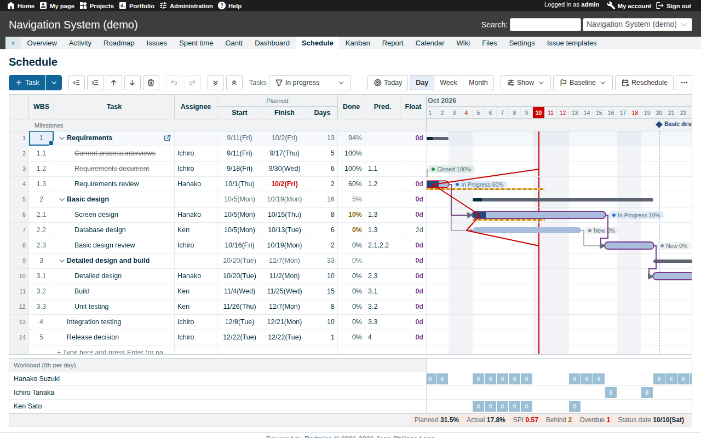
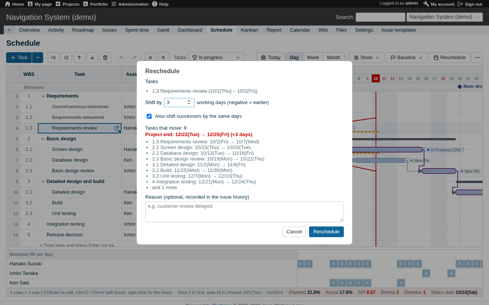
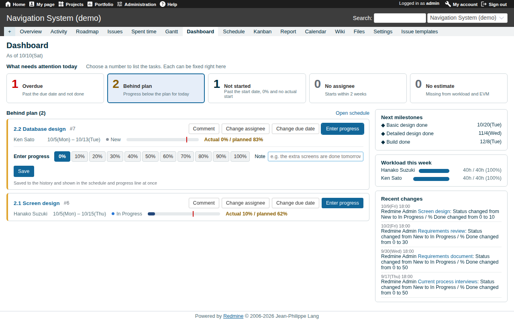
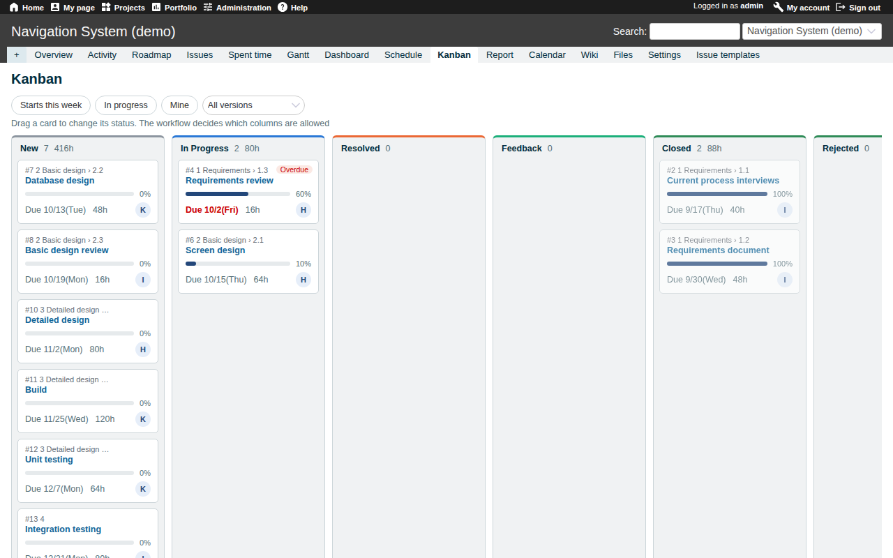
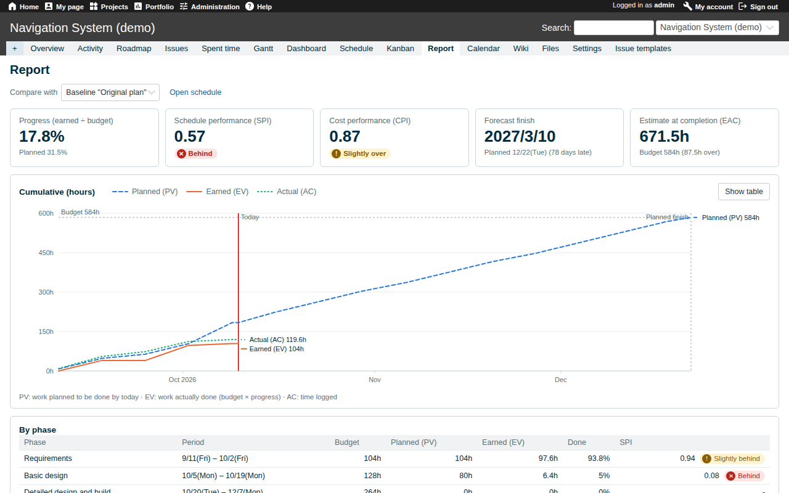
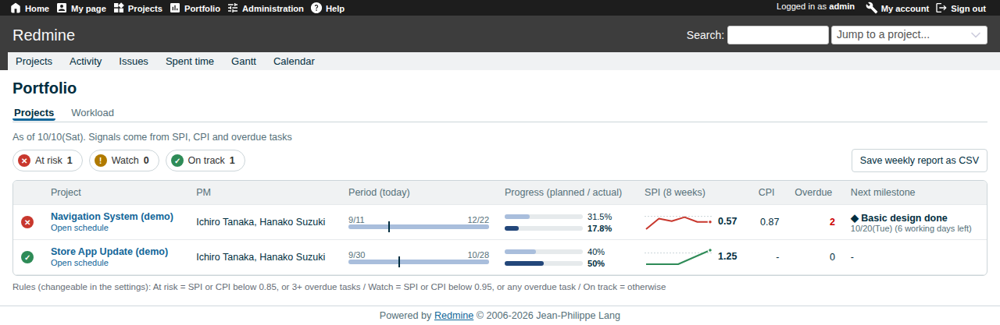

# Gantrix: High-Performance Excel-Compatible WBS & Gantt Chart for Redmine

**English** | [Japanese](README.ja.md)

[](https://github.com/yukkes/redmine_gantrix/actions/workflows/ci.yml)
[](https://www.redmine.org/)
[](LICENSE)
[](https://github.com/rubocop/rubocop)

**Gantrix (Gantt + Matrix)** is an enterprise-grade Redmine scheduling plugin designed to eliminate spreadsheet divergence while delivering project engineering rigor (CPM & EVM) directly inside Redmine.

Built without bulky third-party spreadsheet libraries, Gantrix utilizes a proprietary virtualized rendering grid that mounts and updates 1,000+ tasks in ~0.3 seconds. It bridges the gap between spreadsheet ergonomics and Redmine's robust issue tracking and auditability.

---

## Architecture & Design Principles

### 1. Zero Database Migration Architecture
Gantrix creates **zero custom database tables**.
- **Persistence Mapping**: All task state is mapped to Redmine's native data models: `issues`, `custom_values`, `journals`, and `settings`.
- **System Non-Invasiveness**: Preserves standard issue forms, native Gantt charts, and REST API contracts without side effects.
- **Clean Rollback**: Uninstallation requires only removing the plugin directory and restarting the application server. No database schema rollback is required.

### 2. Internal Data Mapping Specification
| Field / Concept | Persistence Layer | Implementation Detail |
| :--- | :--- | :--- |
| **Actual Start / End Dates** | Issue Custom Fields | Automatically initialized during plugin setup (Date format). |
| **WBS Sort Order** | Issue Custom Field | Hidden from trackers (manages hierarchy internally without cluttering issue UI). |
| **Baselines** | Plugin Settings + Journals | Stores only snapshot timestamps; past attribute states are dynamically reconstructed from Redmine's change log (`journals`). |
| **Calendars & Preferences** | `settings` / User Preferences | Caches holiday calendars and persists per-user UI states. |

### 3. Air-Gapped Network Compatibility
Zero runtime dependencies on external CDNs or external APIs. All static assets, including the 4 KB Tabler Icons font, are bundled locally within the plugin, ensuring 100% functionality in air-gapped on-premises environments.

---

## Screenshots

### WBS & Gantt Canvas (Main Workspace)
Real-time critical path, total float, and dynamic resource workload pane.



| Impact Reschedule Preview | Operational Dashboard |
| :---: | :---: |
|  |  |
| Non-working-day-aware cascading with automatic journal logging | Inline triage of overdue, unstarted, and unassigned issues |

| Workflow-Enforced Kanban | Quantitative Control (EVM Report) |
| :---: | :---: |
|  |  |
| Strictly validates Redmine workflow transition rules | PV / EV / AC curves with automated SPI, CPI, and EAC forecasts |

### Portfolio (Cross-Project Governance)


---

## Technical Specifications & Features

### 1. Spreadsheet-Grade WBS Engine
- **Keyboard-Driven Interaction**: Direct cell typing, `Enter` (down), `Shift+Enter` (up). Implements IME composition guards to prevent unintended commits during Japanese/multilingual input.
- **Clipboard Interoperability**: Range selection, tab-delimited copying, direct paste from Microsoft Excel, fill handle, `Ctrl+D`, and full Undo / Redo stacks (`Ctrl+Z` / `Ctrl+Y`).
- **Bulk WBS Import**: Copy tasks from Excel and paste below the final row; leading whitespace indentation is automatically parsed to construct parent-child issue hierarchies.
- **Interactive Gantt**: Direct timeline dragging, duration resizing, and connector handles to establish or sever `precedes` / `follows` dependencies.
- **Progress Tracking**: Dual planned vs. actual bars, inazuma (progress) line, milestone markers (versions with due dates), and automated actual date backfilling upon % completion updates.

### 2. Smart Rescheduling Engine
- **Calendar-Aware Cascading**: Automatically skips non-working days when shifting dependent successors.
- **Impact Analysis Previews**: Evaluates shifts of $N$ working days and renders a modal preview showing the exact impact on the critical path, project finish date, and successor tasks.
- **Audit Trail Traceability**: Automatically writes shift reasons into Redmine issue journals for auditable change management.

### 3. Quantitative Analytics (CPM & EVM)
- **Critical Path Method (CPM)**: Dynamic calculation of Critical Path and Total Float (in working days).
- **Earned Value Management (EVM)**: Automatically computes Planned Value (PV), Earned Value (EV), Actual Cost (AC), Schedule Performance Index (SPI), Cost Performance Index (CPI), and Estimate at Completion (EAC).
- **Baseline Variance**: Compares current schedules against frozen baselines with split-bar visualizations.

### 4. Governance & Multi-Project Controls
- **RBAC Enforcement**: Integrates with Redmine's Role-Based Access Control (`View schedule`, `Edit schedule`, `Dashboard`, `Kanban`, `Report`).
- **Workflow-Compliant Kanban**: Validates status transitions against Redmine's tracker workflow matrix on drag-and-drop.
- **Portfolio & Organization-Wide Workload**: Cross-project SPI/CPI health thresholds, 8-week SPI trend sparks, weekly CSV exports, and assignee-by-week workload heat maps.
- **Event-Driven Alerts**: Fires email notifications to assignees when all predecessor dependencies are resolved.

---

## Working-Day & Holiday Engine

Configured under **Administration > Gantrix settings**:

1. **Japanese Public Holidays (Default)**:
   - Downloads and caches the Cabinet Office CSV dataset (refreshed in the background every 30 days).
   - Calculates the years the official data does not cover (1949-2150), following the rules of each year (moved holidays, substitute and in-between holidays, imperial ceremonies); checked against the official list for 1955 onwards.
   - Dates outside those years (such as 9999-12-31 for "no end") are valid and have no holidays.
2. **Custom CSV Import**:
   - Supports custom corporate or regional calendars. Upload `YYYY-MM-DD,Holiday Name` formatted CSVs (UTF-8 or Shift_JIS).
3. **Disabled (Standard Weekdays Only)**:
   - Applies Redmine core non-working week days alongside manually entered company shutdown periods.

---

### Dates far from the rest

A due date of 9999-12-31 or a typo such as the year 3 does not stretch the screens over thousands of years. The schedule draws at most five years around today (dates more than two years away from the others are left out of the period) and cuts bars that run past it; the report leaves such tasks out of the earned value and says how many. Working days are counted by arithmetic, so long periods cost no more than short ones.

## Installation & Deployment

### Prerequisites
- Redmine: `5.0.x`, `5.1.x`, `6.0.x`, `6.1.x`, `7.0.x`
- Ruby: Version supported by target Redmine release
- Database: MySQL / PostgreSQL / SQLite3

### 1. Deploy Plugin Directory
```bash
cd /path/to/redmine/plugins
git clone https://github.com/yukkes/redmine_gantrix.git   # the directory must be named redmine_gantrix
# To update later: cd redmine_gantrix && git pull
```

### 2. Restart Application Server (No Migration Needed)
```bash
# Note: Executing `rake redmine:plugins:migrate` is NOT required.
touch /path/to/redmine/tmp/restart.txt
# Or restart your Puma / Unicorn / Passenger / Systemd service
```

### 3. Post-Install Configuration
1. **Administration > Gantrix settings**: Verify holiday calendar and company-specific non-working dates.
2. **Administration > Roles and permissions**: Grant the permissions listed under `Schedule (Gantrix)`, `Dashboard (Gantrix)`, `Kanban (Gantrix)` and `Report (Gantrix)` to designated roles.
3. **Project Settings > Modules**: Enable `Schedule (Gantrix)` in target projects.
4. **Administration > Settings > Display > Theme** (optional): Select the bundled theme `Gantrix`: Redmine's default layout with the colors and icons of lychee_theme_basic (Redmine 5.1 / 6 / 7, no JavaScript).

---

## Recommended Plugins

These plugins are tested together with Gantrix on Redmine 5.0-7.0 (`docker/dev/test_all.sh`) and are included in the deployment image (`docker/deploy/`).

| Plugin | Author / License | Purpose |
| :--- | :--- | :--- |
| **[redmine_microsoftteams](https://github.com/yukkes/redmine_microsoftteams)** | yukkes / MIT | Posts issue and wiki updates to Microsoft Teams. |
| **[redmine_merge_request_links](https://github.com/yukkes/redmine_merge_request_links)** | yukkes / MIT | Shows the GitHub, GitLab, Gitea and CodeCommit pull requests linked to an issue on its page. |
| **[redmine_textile_transparent](https://github.com/yukkes/redmine_textile_transparent)** | yukkes / MIT | Adds a Hybrid text format: existing Textile keeps rendering as Textile, new text is written in Markdown. No data conversion. |
| **[redmine_issue_templates](https://github.com/agileware-jp/redmine_issue_templates)** | Agileware / GPL-2.0 | Issue and note templates per project and tracker. |
| **[redmine_issue_trash](https://github.com/agileware-jp/redmine_issue_trash)** | Agileware / MIT | Moves deleted issues to a trash for restoring. Gantrix keeps baselines and EVM consistent across deletions and restores issue relations upon undelete. |

---

## Verification Environment (Docker)

A multi-version test environment with seeded demo projects is available out of the box:

```bash
# Builds and boots Redmine 5.0, 5.1, 6.0, 6.1, and 7.0 (ports 3050, 3005, 3060, 3006, 3007)
docker/dev/up.sh
```

| Environment | URL | Credentials |
| :--- | :--- | :--- |
| **Redmine 5.0** | `http://127.0.0.1:3050/projects/demo/gantrix` | Admin: `admin` / `admin`<br>Users: `tanaka`, `suzuki`, `sato` (Pass: `password123`) |
| **Redmine 5.1** | `http://127.0.0.1:3005/projects/demo/gantrix` | Identical |
| **Redmine 6.0** | `http://127.0.0.1:3060/projects/demo/gantrix` | Identical |
| **Redmine 6.1** | `http://127.0.0.1:3006/projects/demo/gantrix` | Identical |
| **Redmine 7.0** | `http://127.0.0.1:3007/projects/demo/gantrix` | Identical |

### Test Runner Commands
```bash
docker/dev/test_all.sh            # Executes clean install test across all 5 versions (CI equivalent)
docker/dev/test_all.sh 5.0 7.0    # Same, for the given Redmine versions only
PERF=1 docker/dev/test_all.sh     # Same, plus the 1,000-task rendering benchmark
npm i playwright && npx playwright install chromium   # Once, for the browser tests
node docker/dev/ui_test.js 3006   # Headless browser validation via Playwright (needs freshly seeded demo data)
node docker/dev/plugins_test.js 3006 # Checks the recommended plugins with Playwright
python3 docker/dev/smoke_test.py 3006 # API & HTTP endpoint smoke tests
docker compose -f docker/dev/compose.yml exec redmine-6.1 bin/rails runner /seed/checks/perf_seed.rb   # Seeds the 1,000-task benchmark project
node docker/dev/perf_test.js 3006 # Benchmarks rendering performance on 1,000 tasks (after the line above)
docker compose -f docker/dev/compose.large.yml up -d   # Redmine 7 + PostgreSQL limited like the ECS task (0.5 vCPU / 1 GB)
docker compose -f docker/dev/compose.large.yml exec -T redmine bin/rails runner /seed/checks/large_seed.rb   # 34,000 issues, 135,000 journals
node docker/dev/large_test.js 3008 # Every screen must be drawn within 3 seconds on that project
docker/dev/screenshots.sh         # Retakes the README screenshots (English and Japanese demo data)

# Teardown
docker compose -f docker/dev/compose.yml down -v
```

### Deployment Image (Redmine 7 + PostgreSQL 17)

`docker/deploy/` builds a Redmine 7 image with this plugin (including the bundled theme `Gantrix`) and its companion plugins, and runs it with PostgreSQL 17:

```bash
docker compose -f docker/deploy/compose.yml up -d --build   # http://127.0.0.1:3000
```

Set `POSTGRES_PASSWORD` and `SECRET_KEY_BASE` before using it beyond a trial (see `docker/deploy/compose.yml`).

---

## License

Distributed under the **[MIT License](LICENSE)**. Approved for proprietary, commercial, and enterprise production environments.
