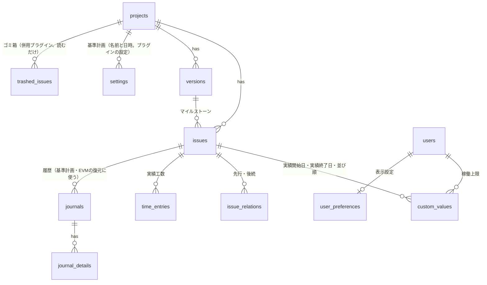

# データ設計（独自テーブル0）

対象: Gantrix の全機能（工程表・ダッシュボード・カンバン・レポート・全体レポート）
方針: **独自テーブルを持たない。** すべてのデータをRedmine標準のテーブル・カスタムフィールド・設定に載せ、残せないものは変更履歴から計算する。
併用プラグイン: 削除したチケットはゴミ箱プラグイン（`redmine_issue_trash`）に退避し、基準計画とEVMの計算にも含める（5章）。

## 1. 結論

| 区分 | 数 | 内容 |
|---|---|---|
| 独自テーブル | **0** | このプラグインはmigrationを持たない |
| 標準テーブル（そのまま利用） | 11 | `issues`, `issue_relations`, `versions`, `time_entries`, `journals`, `journal_details`, `queries`, `user_preferences`, `settings`, `custom_fields`, `custom_values` |
| カスタムフィールド（プラグインが作成・管理） | 3 | チケット: 実績開始日・実績終了日・並び順 |
| 併用プラグインのテーブル（読むだけ） | 1 | `trashed_issues`（ゴミ箱プラグインが持つ。入っている場合だけ読む） |

**得られること**
- Redmineの更新、プラグインの導入・削除でDBのmigrationが不要
- バックアップ・移行・REST APIがRedmine標準のまま
- 基準計画を後からでも作れる（過去の日時を指定すると、その時点の計画を履歴から復元する）


## 2. 機能ごとの保存先

| 機能 | 保存先 |
|---|---|
| タスク・担当・予定開始・予定終了・進捗率 | `issues` |
| WBSの階層 | `issues.parent_id`（`lft` / `rgt`） |
| WBSの並び順 | チケットのカスタムフィールド「並び順」（3.3節） |
| 実績開始日・実績終了日 | チケットのカスタムフィールド（3.1節） |
| 予定工数 / 実績工数 | `issues.estimated_hours` / `time_entries.hours` の合計 |
| 先行・後続（遅延日数を含む） | `issue_relations`（`precedes`, `delay`） |
| マイルストーン | `versions.effective_date` と `issues.fixed_version_id` |
| リスケ理由・変更履歴 | `journals` / `journal_details` |
| 基準計画 | 名前と日時だけをプラグインの設定（`baselines`、プロジェクトIDごと）に持ち、計画は履歴から復元（4.1節） |
| EVM・週次の推移・全体レポート | 履歴から計算（4.2節） |
| 削除したチケット | ゴミ箱プラグインの `trashed_issues`（5章） |
| クリティカルパス・余裕日数・担当者の負荷 | `issues` と `issue_relations` から計算 |
| 1日の稼働上限 | ユーザーのカスタムフィールド（未設定ならプラグイン設定の既定値） |
| 絞り込み条件 | `queries`（Redmine標準の `IssueQuery`） |
| 表示設定（列、表示単位、折りたたみ、絞り込み） | `user_preferences.others`（`gantrix_views`） |
| 祝日（内閣府CSVのキャッシュ、インポートしたCSV）・会社休日 | `settings`（`plugin_redmine_gantrix`、6章） |
| 先行完了の通知 | メール送信のみ（保存しない） |

## 3. カスタムフィールド

プラグインの初回起動時（または設定画面の「初期設定」）に作成し、作成したIDをプラグイン設定に保存する。名前ではなくIDで参照するので、管理者が名前を変えても動く。見つからない場合は設定画面に警告を出し、作り直せるようにする。

| 名前 | 種類 | 形式 | 表示 | 更新方法 |
|---|---|---|---|---|
| 実績開始日 | チケット | 日付 | 全員に表示 | 通常のチケット更新（履歴に残る） |
| 実績終了日 | チケット | 日付 | 全員に表示 | 同上 |
| 並び順 | チケット | 整数 | どのトラッカー・プロジェクトにも割り当てない（チケット画面・一覧に出ない） | 値を直接書き換える（履歴に残さない） |
| 基準計画 | プロジェクト | 長いテキスト（JSON） | 管理者のみ（非表示） | 値を直接書き換える |
| 1日の稼働上限（時間） | ユーザー | 小数 | 本人と管理者 | 個人設定から |

### 3.1 実績開始日・実績終了日
- 全トラッカー・全プロジェクトを対象に作成する。
- 標準のチケット画面・チケット一覧・CSV・REST APIで扱え、変更は履歴に残る。
- 未入力のときの表示: 開始は最初の作業時間の日付（`time_entries.spent_on`）、終了は `issues.closed_on`。

### 3.2 基準計画（プラグインの設定）
プロジェクトのカスタムフィールドは、非表示にしても管理者にはプロジェクトの概要に表示されるため使わない。プラグインの設定にプロジェクトIDごとに持つ。
```json
"baselines": {
  "12": [
    {"id": "b1", "name": "当初計画", "at": "2026-09-07T09:00:00.000000+09:00", "user_id": 5},
    {"id": "b2", "name": "第1回リスケ後", "at": "2026-09-30T18:00:00.000000+09:00", "user_id": 5}
  ]
}
```
- 保存するのは名前と日時だけ（1件あたり約100バイト）。計画の中身は4.1節の方法で復元する。
- 日時はマイクロ秒まで保存する（秒単位だと、保存の直前の同じ1秒内の変更が「基準計画より後」と判定されて復元を誤る）。
- 「今の計画を保存」は現在日時を、「過去の日時を基準にする」は指定した日時を記録する。
- 保存は設定の行をロックして読み直してから書き戻す（`Gantrix::Settings.change`）。祝日のキャッシュや管理画面の保存と同時に行っても上書きしない。

### 3.3 並び順（チケットのカスタムフィールド）
- 同じ親を持つ兄弟の中での順番。10、20、30…と間隔を空けて付け、間に入れるときは中間の値（15など）を使う。間隔が詰まったときだけ兄弟全体を振り直す。
- **値は `custom_values` を直接更新**し、チケットの履歴・更新日時・通知には影響させない。
- 値がないチケットは、開始日 → ID の順に並べる（現行と同じ）。
- Redmineではカスタムフィールドを「非表示」にするとロールの指定が必須になり、そのロールのメンバーには見えてしまう。そのため、どのトラッカー・プロジェクトにも割り当てないことで、チケット画面・一覧に出ないようにする（管理画面のカスタムフィールド一覧には出るので、説明欄に「工程表が自動で管理します。編集しないでください」と書く）。

## 4. 履歴からの計算

### 4.1 基準計画の復元
時刻 T の計画を、今の値から履歴を逆にたどって求める。

1. 対象: プロジェクトのチケットのうち `created_on <= T` のもの。ゴミ箱プラグインがあれば、`T` より後に削除されたチケットも含める（5章）
2. 開始値: 今の `start_date`, `due_date`, `estimated_hours`, `done_ratio`
3. `journals.created_on > T` の `journal_details`（`property='attr'`, `prop_key` が上の4項目）を新しい順にたどり、`old_value` で値を戻す
4. 親チケットの値は、復元した子の値から集計する（親の自動計算は履歴に残らないため使わない）

| 前提・制約 | 対応 |
|---|---|
| 画面・REST API・一括編集・CSV取込の変更は履歴に残る | 通常の運用では正しく復元できる |
| SQLで直接書き換えた変更は復元できない | 運用で禁止する（READMEに記載） |
| Redmine本体の自動リスケ（先行の変更で後続が動く）が履歴に残るか | **残る（2026-10-08、Redmine 5.1.12 / 6.1.5 / 7.0.2で確認。`docker/dev/checks/reschedule_journal.rb`）。** 後続の開始日・期日の変更が履歴に記録されるため、補う処理は不要 |
| 削除したチケット | ゴミ箱プラグインがあれば復元できる（5章）。ない場合は復元できないので、ステータスで閉じる運用を案内する |
| 計算の負荷 | 「基準計画の日時＋プロジェクトの最新の履歴ID」をキーに `Rails.cache` に保存する。1,000チケットで1秒以内を目標にする |

### 4.2 EVM・推移の計算
| 値 | 求め方 |
|---|---|
| PV（計画価値） | 4.1節で復元した基準計画の予定工数を、開始〜期日の稼働日に割り振って日ごとに累計 |
| EV（出来高） | 末端チケットの「予定工数 × 進捗率」。過去の進捗率は4.1節と同じ方法で履歴から復元 |
| AC（実コスト） | `time_entries.hours` を `spent_on` ごとに累計 |
| SPI / CPI / EAC | 上の3つから計算 |
| 全体レポートの信号 | プロジェクトごとのSPI・CPI・期限超過件数としきい値（`settings`）から判定 |

必要なインデックスはRedmine標準で揃っている（`journals` の `journalized_id` / `journalized_type`、`journal_details` の `journal_id`、`time_entries` の `issue_id`）。

実装は `Gantrix::Evm`（`app/models/gantrix_evm.rb`）。計画は選んだ基準計画（既定は最新）か現在の計画、点は週ごと（最大60点）と今日。予定工数がないプロジェクトでは予定期間の稼働日数を重みにし、AC・CPI・EACは出さない。

### 4.3 絞り込み

チケット一覧で保存したクエリ（`queries`）をそのまま使う。`IssueQuery#issue_ids` で一致したチケットと、その祖先（階層を保つための文脈として薄く表示）を返す。独自の絞り込み条件は持たない。

クエリを選んでいないときは、完了したタスクを既定で読み込まない（長く続くプロジェクトではほとんどが完了済みのため）。未完了のタスクと、`closed_on` が14日以内のタスク（`GantrixController::RECENT_CLOSED_DAYS`）に、その祖先を文脈として加えて返す。「完了も表示」で全件を読み込む（ユーザーごとの表示設定 `showClosed`）。クエリを選んだときは、状態の絞り込みもクエリに任せる。

表示しないタスクがあっても、次の値は全件から求め、全件を表示したときと同じにする。

| 値 | 方法 |
|---|---|
| WBS番号 | `Gantrix::Tree` で全件から付ける |
| 親の日付・進捗・工数 | 表示する親ごとに、その下の表示しない末端タスクの合計（最小開始日・最大終了日・実績日・稼働日数・稼働日数×進捗率・予定工数・実績工数）を返し、画面が自分の子と合わせて集計する |
| 上部の集計（予定進捗・実績進捗・SPI・遅れ・期限超過） | 表示しない末端タスクの合計を返し、画面が加える |
| 余裕日数（クリティカルパス） | 全件と全関連から求める |
| 先行タスク | 表示するタスクの先行関連は、先行側が表示されていなくても返す（先行の編集で消さないため） |

稼働日数は、画面に渡す祝日だけで数える（画面が自分のタスクを数えるのと同じ）。

## 5. ゴミ箱プラグインとの連携

[redmine_issue_trash](https://github.com/agileware-jp/redmine_issue_trash)（アジャイルウェア、MIT、Redmine 4.2以降）は、チケットを削除する直前に「ゴミ箱へ移動」の履歴を追加し、チケットの値・カスタムフィールドの値・子チケットのID・関連・ウォッチャー・履歴（非公開メモを除く）・添付ファイルを、自身のテーブル `trashed_issues` の `attributes_json` に保存する。復元すると元のチケットIDのまま戻る。

| 項目 | 方針 |
|---|---|
| 位置づけ | **推奨の併用プラグイン**（必須ではない）。このプラグインには同梱しない |
| 検出 | `defined?(TrashedIssue)` で有無を判定する。無い場合は連携をすべて無効にする |
| 基準計画・EVM | `trashed_issues.created_at > T` のチケットを、`attributes_json` の値と `journals` から4.1節と同じ方法で復元し、計算に含める。工程表の比較では「削除済み」と表示する |
| 工程表の削除操作 | 「ゴミ箱へ移動」と表示する（ゴミ箱プラグインがない場合は「削除」） |
| 復元されたチケット | 元のIDで戻るので、並び順・実績日（カスタムフィールド）もそのまま戻る |

**ゴミ箱プラグインの制約**（ソースコードで確認。工程表側で補う）

| 制約 | 影響 | 工程表側の対応 |
|---|---|---|
| 先行・後続などの関連は復元されない（親子関係のみ） | 復元後に依存関係が消える | 実装済み：ゴミ箱の記録が消えるとき（`TrashedIssue` の `after_destroy`）、チケットが復元されていれば `attributes_json` の `relations` から、相手のチケットが残っている関係を自動で作り直す |
| 作業時間は保存されない（削除時にRedmineが付け替え・削除を選ばせる） | 削除を選ぶとACが減る | 実装済み：工程表からの削除では作業時間をプロジェクトに残す（チケット必須の設定では親タスクへ付け替え）。Redmine標準の画面から削除する場合はRedmineの選択に従う |
| 非公開チケットはゴミ箱に入らない | 復元できない | 制約としてREADMEに書く |
| ゴミ箱プラグインを入れる前に削除したチケットは対象外 | 過去の基準計画から抜ける | 導入手順で、工程表より先にゴミ箱プラグインを入れるよう案内する |

## 6. プラグイン設定（`settings.plugin_redmine_gantrix`）

| キー | 既定値 | 用途 |
|---|---|---|
| `holiday_source` | `jp` | 祝日の取得元（`jp` / `imported` / `none`） |
| `jp_cache` / `jp_cache_fetched_at` / `jp_cache_attempted_at` / `jp_cache_error` | 空 | 内閣府CSVのキャッシュと取得状態 |
| `imported_holidays` / `imported_name` / `imported_at` | 空 | インポートした祝日CSV |
| `extra_holidays` | 空 | 会社休日 |
| `cf_actual_start` / `cf_actual_end` / `cf_position` | 作成時に設定 | 3章のカスタムフィールドのID |
| `baselines` | 基準計画を保存したとき | プロジェクトIDごとの基準計画（名前と日時） |
| `default_capacity` | `7.5` | 稼働上限の既定値 |
| `parent_progress` | `weighted` | 親の進捗の算出（`weighted` / `count`） |
| `notify_successors` | `1` | 先行完了の通知 |
| `signal_spi_warn` / `signal_spi_bad` | `0.95` / `0.85` | 全体レポートの信号のしきい値 |

設定は専用の管理画面（管理 → 工程表の設定）から差分だけを書き込む。Redmine標準のプラグイン設定画面は、保存のたびに設定全体を置き換えるため使わない。

**ユーザーごとの表示設定**は `user_preferences.others` の `gantrix_views` キーに、プロジェクトIDごとに保存する（`Gantrix::Preferences`。表示単位、追加した列、折りたたみ、比較する基準計画、絞り込みのクエリ、完了の非表示、イナズマ線）。値は保存時に検査し、最大100プロジェクト・折りたたみ2,000件まで（古いプロジェクトから消える）。ログインしていないユーザーはブラウザの `localStorage` に保存する。


追加した設定（2026-10-08）: `notify_successors`（先行完了の通知）、`hours_per_day`（負荷の計算）、`status_colors`（ステータスID→色。既定と違う色だけ保存）、`signal_red` / `signal_amber` / `signal_overdue`（全体レポートの信号）、`pm_role_ids`（PMとして表示するロール）。全体レポートの各行は `Rails.cache` に保存し、履歴・作業時間・チケットの更新で作り直す（テーブルは使わない）。

## 7. アンインストール
- プラグインを外すだけでよい（削除するテーブルがない）。
- カスタムフィールドは、入力済みの実績日が消えないよう残る。不要なら管理画面から削除する（手順をREADMEに書く）。

## 8. データの関係


